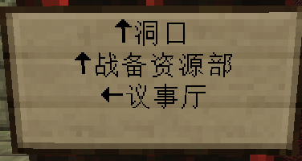
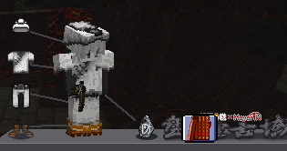
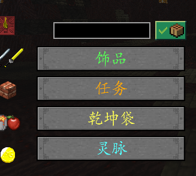

# 快速入门

进入服务器后使用指令 `/register` 注册账号便可开始游玩。本服为离线服务器，无需正版，改变 ID（大小写敏感）即可注册或登录。

> **请确保进服前装载了盘龙阁官群中的专属资源包，否则无法正常游玩！**

---

## 一、种族选择

进入服务器后第一件事是选择种族。本服**完全修改了种族天赋**，由原版 BUFF 改为自定义属性，通过主线进度（四圣试炼 + 圣山）成长，最高 6 级。

| 种族 | 满级效果 | 推荐 |
|------|---------|------|
| **战神族** | +8 基础攻击力 | 战士首选、弓箭手输出向 |
| **人族** | +30 基础护甲 | - |
| **神族** | +30 基础生命 | - |
| **妖族** | +1.2 每秒生命回复 | 阵法师续航向 |
| **仙族** | +15 生命 & +20 护甲（约） | 均衡型 |

> 详请参见 [种族天赋](/种族天赋.md)

---

## 二、领取菜单

在种族出生点附近寻找**按钮**，领取【天道菜单】—— 包含几乎所有关键功能。

### 菜单常用功能

| 功能 | 说明 |
|------|------|
| **个人信息** | 查询属性、资产、副本开箱状况 |
| **储物空间** | 随身仓库（与背包乾坤袋同一功能） |
| **常用功能** | 补领种族证明、对话泡泡、新芽之羽、找回神器、快速自杀 |
| **三界通鉴** | 服务器更新信息、玩家排行、**征讨队**（组队打本） |
| **重华晶** | 传送功能，青龙试炼后解锁 |
| **元素熔炉** | 元素储存提取，朱雀试炼后解锁 |

### 按钮无法点击？请确认
- 搜索栏内没有输入任何内容
- 搜索栏右侧没有红色提示按钮
- 最左边一栏选择的是最上方的**指南针**

---

## 三、主线流程

### 第一步：前往皇城

沿着告示牌指引前往人族皇城，期间可去种族商店免费获得基础物品。

> 注：本服没有剧情任务，主线剧情可以忽略。

### 第二步：领取锤锻之方

抵达皇城后前往西南部铁匠铺（坐标 **80, 46, 140**），在**铁匠铺掌柜—王冶**处用对话泡泡换取【锤锻之方】。**锤锻之方 = 本服主线**，跟随东西南北方向做出书中的装备。

### 第三步：操作要点

- **配方书合成**：点击左下角书按钮切换
- **可合成物品显示**：右上角有提示则点击关闭
- 背包**左边**有饰品栏，没有显示请检查上述两点
- **乾坤袋**：快速打开菜单中的随身仓库
- **任务按钮**：接取任务后显示任务说明与目标
- **灵脉功能**：暂时无效

### 第四步：青龙试炼

前往东方的**龙鳞之森** → 跟随告示牌到森林深处的**青龙祭坛** → 大殿二楼通过 20 道选择题。

完成后：
- 获得饰品**智启**（二号位）
- 解锁重华晶传送功能

### 第五步：后续方向

1. **10 级后**：前往皇城丹药铺出门左转（293, 46, 26）接取**剑技/射术任务**
2. **制造装备**：跟随锤锻之方制作当前阶段装备
3. **四圣试炼**：青龙→朱雀→白虎→玄武，每次完成后种族天赋升级
4. **副本阶段**（五阶开始）：始皇陵→火焰魔王巢穴→镇妖塔→哭声回荡的山谷→圣山
5. **DLC 阶段**（六阶毕业后）：烧火境→山神庙（峻极殿）

---

## 四、关键 NPC 速查

| NPC | 坐标 | 功能 |
|-----|------|------|
| 铁匠铺掌柜—王冶 | 80, 46, 140 | 锤锻之方、锻铁、解灵神水、天凰炎华 |
| 附灵师—太一 | 79, 46, 145 | 装备附灵 |
| 炼丹铺掌柜—李荣 | 255, 49, 23 | 炼丹 |
| 天师—张道陵 | 76, 46, 143 | 符纸（阵法师） |
| 商阳子 | 293, 46, 26 | 剑技学习/任务（战士） |
| 箜篌子 | 293, 47, -2 | 射术流派选择（弓箭手） |
| 元素师—李誉 | 253, 49, 26 | 元素第一阶段升级 |
| 陈大夫 | -119, 46, 139 | 元素第二阶段升级 + 刷丝绸 |
| 太上老君 | 339, 33, -716 | 元素第三阶段升级 |
| 南北杂货批发 | 101, 46, 185 | 购买钥匙、升级羽毛 |
| 神秘商人 | 77, 47, 103 | 彩色晶块出售（1 银票/个） |
| 旅行商人 | -397, 112, 151 | 金毅装备、法宝 |

---

## 五、新手须知

### MOD 兼容性

服务器重做了部分 UI，**不要安装**：显血类、苹果皮、高清修复等画面表现 MOD。服务器已内置 toro 血量显示。

### 资源包

- 必须安装盘龙阁专属资源包（群文件"玩盘灵点进来"文件夹下载）
- 建议先不装资源包→调整服务器视距→再装对应视距资源包
- 每次上线视距会重置为默认 8，需更高视距请上线后重新调整

### 装备与附灵

- 装备在铁匠铺锻造台制造，手持锤锻之方右键打开
- 附灵在附灵师 NPC 处进行，替换附灵返还全部材料
- ⚠️ 四升五品质时**不返还**附灵材料
- ⚠️ 部分六阶防具升级品质时附灵材料不返还，先用一阶附灵替换高阶附灵

---

## 更多指引
- [盘龙阁入门指引](/盘龙阁入门指引.md) — 服务器全方位信息整合，萌新首选
- [常见问题（FAQ）](/常见问题.md) — 异常表现排查方法
- [三职业评价](/三职业评价.md) — 各职业全时期强度参考
- [装备扫盲](/装备扫盲.md) — 各职业装备选择避坑指南
