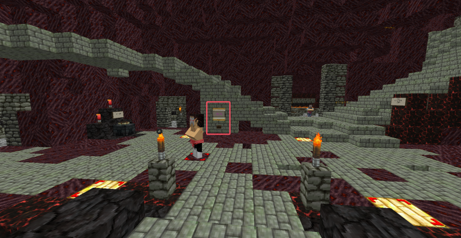
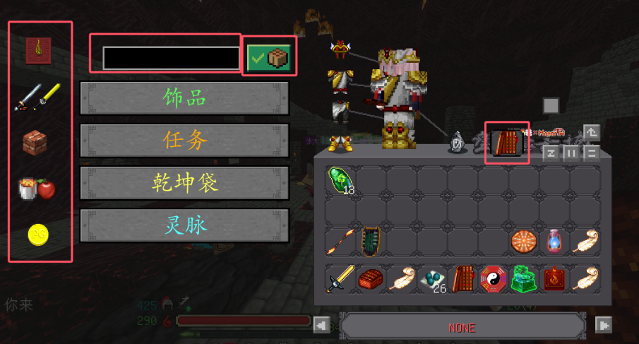
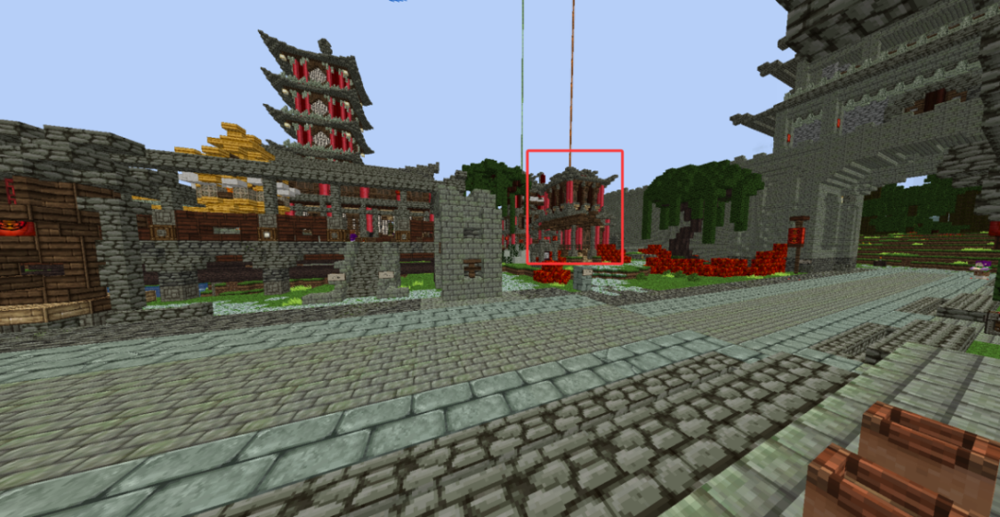
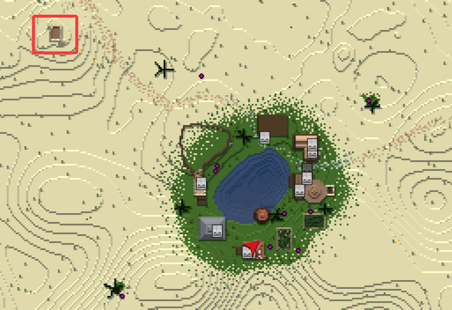
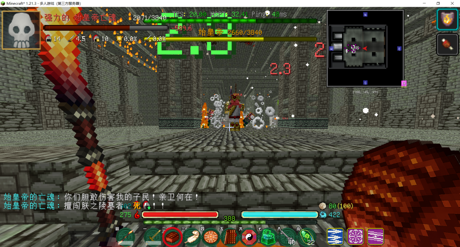
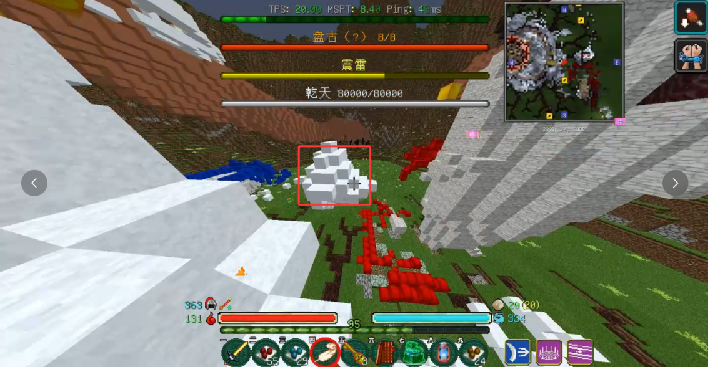

# 原六战士全流程攻略

> 本文档覆盖战士从零到六阶毕业的完整开荒流程。Ctrl+F 可快速查询需要的内容。攻略内容较多，可直接跳转至当前阶段观看。

## 职业总评

战士是同时具备**高生存、高伤害、高拐力**的全面职业。日常舒适度高，副本能辅能 C。比较吃游戏理解——选错武器分支、剑技、装备都会导致体验差距巨大。

> **推荐种族**：仅战神族。如果选的不是战神族且刚玩不久，建议开小号重开。

## 核心原则

- 服务器难度较高，不是拿着剑贴怪瞎砍拼数值的游戏
- 战士最弱的前三阶一定不能硬吃怪物伤害，要卡点打智取
- 战士是能辅助的输出职业——辅助只是顺便，把自己的输出打出来才是最重要的
- 烧火镜除外（需要全肉辅助），其他时候优先保证自己输出足够

---

## 前期准备

1. 开局在种族出生点附近按钮处领取菜单
2. 背包乾坤袋→上一页可使用菜单（若没有乾坤袋按钮，点击原版合成书）
3. 若按钮无法点击：确认搜索栏无内容、搜索栏右侧无按钮、左侧栏选最上方指南针
4. 到达皇城前往 **82, 46, 140** 铁匠铺掌柜处兑换锤锻之方
5. 10 级后前往皇城丹药铺出门左转 **293, 46, 26** 接取剑技任务

---

## 剑技任务与推荐

剑技任务一共 20 个，每个给 1 个技能点。学习技能不消耗技能点，只消耗银票。技能描述的技能点消耗是携带此技能需要拥有的技能点数量。

> 详细任务流程参见 [战士/任务指引](/战士/任务指引) | 剑技机制详解参见 [战士/剑技](/战士/剑技)

### 各阶段推荐

| 阶段 | 推荐剑技 | 备注 |
|------|---------|------|
| 前期 2~3 阶 | 流星、瞬剑术 | 瞬剑术需攻速附灵 |
| 中期 4~5 阶 | 千雪、瞬剑术 | 瞬剑术需攻速附灵 |
| 后期 6 阶 | 千雪、万里山河、逍遥 | 综合输出+拐力 |
| 烧火毕业 | 万里山河、太虚、逍遥 | 持续输出拐力型 |

> 达到 8 个技能点后建议学习千雪并卸下其他剑技换上千雪。

---

## 前期（1~3 阶）

### 一阶

- 按锤锻之方制作一阶装备
- 东方龙鳞之森刷基础材料
- 完成青龙试炼获取**智启**

### 二阶

- 继续东方刷材料升级二阶装备
- 完成剑技任务第 1-3 个
- 第三个任务需要完成 2 次简单始皇陵，建议三阶毕业再尝试

### 三阶

- 南方刷材料升级三阶装备
- 武器分支选择：**破军**（输出）/ **金钟**（坦克）/ **横扫**（综合）
- 推荐：破军（前期输出最实用）
- 完成朱雀试炼

---

## 中期（4~5 阶）

### 四阶

- 西方刷材料，挑战白虎试炼
- 开始挑战副本：简单/普通难度始皇陵、普通火焰魔王巢穴
- 剑技点数积累到 8+ 后可装配千雪

### 五阶

- 北方刷材料，挑战玄武试炼
- 挑战副本：困难始皇陵、困难火魔、困难镇妖塔顶层
- 五阶武器**降魔杵**（金箍棒前身）舒适度极高

### 五阶副本路线

---

## 后期（6 阶）

### 原六副本

- 挑战困难模式全部副本：始皇陵、火魔、镇妖塔顶层/塔底、哭声回荡的山谷、圣山
- 获取六阶传说装备和武器

### 武器推荐

**核心武器**：
- **金箍棒** — 当前版本真神，全期可做，常驻加速和回血
- **指天剑** — 版本陷阱，最多做个蓝色过渡，做红是浪费
- **绝峭** — DLC 纯肉战士刚需
- **炽火** — DLC 战士核心武器（烧火境掉落）

### 护甲选择

| 护甲 | 定位 |
|------|------|
| **九黎战铠** | 输出战士首选 |
| **太初神甲** | 生存战士首选 |
| **混天绫** | 平衡型 |
| **韦驮天** | 辅助向 |
| **紫砂缠** | 山神庙必备 |
| **风火轮** | 移速向 |

---

## DLC 阶段

### 烧火境

> 详细攻略参见 [副本相关/烧火境](/副本相关/烧火境)

**纯肉战士（有输出队友时）**：
- 附灵 4 生机，主武器**绝峭**
- 饰品：哭头、太初、始皇裤、哭鞋、朱雀、玄武
- 剑技：万里山河、逍遥、青松
- 打法：拉好 BOSS 仇恨固定角落，保证绝峭技能常驻

**半肉输出（无输出队友时）**：
- 附灵 4 磐岩，主武器**太极剑**
- 饰品：火头、太初/九黎、塔裤、哭鞋、青龙、白虎
- 剑技：万里山河、逍遥、瞬剑术、太虚

### 山神庙（峻极殿）

> 详细攻略参见 [副本相关/山神庙](/副本相关/山神庙)

战士在烧火毕业后进山本，兼顾拐力、容错和输出：
- 附灵 2 战狂以上混搭
- 主武器**炽火**，副手推荐**绝峭**
- 全程保持炽火连线易伤与万里山河
- 每关有具体技巧区别，详见山神庙攻略页面

---

## 刷怪点位参考

| 阶段 | 区域 | 推荐点位 |
|------|------|---------|
| 1-2 阶 | 东方 | 龙鳞之森、废弃村庄 |
| 3 阶 | 南方 | 马贼窝、沙漠客栈周边 |
| 4 阶 | 西方 | 金矿小镇、虎爪山脉 |
| 5 阶 | 北方 | 白骨林、蓬莱周边 |
| 6 阶 | 全图 | 镇妖塔、哭声回荡的山谷 |

---

## 相关页面
- [战士/剑技](/战士/剑技) — 剑技完整机制与 BUG 总结
- [战士/任务指引](/战士/任务指引) — 20 个剑技任务详细流程
- [职业介绍](/职业介绍) — 战士职业概览
- [三职业评价](/三职业评价) — 各时期强度对比
- [装备扫盲](/装备扫盲) — 装备避坑指南
- [副本相关/烧火境](/副本相关/烧火境)
- [副本相关/山神庙](/副本相关/山神庙)
- [快速入门](/快速入门)
