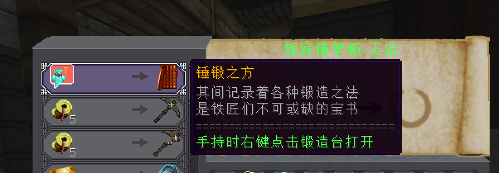

# 职业的选择

种族特性在四圣兽试炼与圣山升级，最高六级，在游戏前期能提供极大增益。 升级流程：青龙试炼（1 -> 2）、朱雀试炼（2 -> 3）、白虎试炼（3 -> 4）、玄武试炼（4 -> 5）、通关一次圣山（5 -> 6） 
战神族：1.5\2.5\3.5\4.5\6\8基础攻击力（最建议选择的种族）
人族：5\10\15\20\25\30基础护甲
神族：5\10\15\20\25\30基础生命
妖族：0.6\0.7\0.8\0.9\1\1.2每秒生命生命回复
仙族：最高15基础生命与最高20基础护甲

由于在盘龙阁服务器中，阵法师在后期的所有元素属性都与阵法强度挂钩，例如：浓缩金元素的伤害、浓缩木元素的回血量、浓缩水元素的虚弱、浓缩火元素的攻击力加成、浓缩土元素的护盾量。**因此，玩炼丹师只推荐选择战神族。**

## 前期（0-10）

在本盘龙阁服务器中，**没有主线任务！** 仅有三个支线任务：[客栈杀人魔]、[恶医李大夫]和[雨竹]，可以将在铁匠铺门口[铁匠铺掌柜-王治]兑换的[锤锻之方]内的装备理解为是主线任务。

**皇城铁匠铺坐标：82 46 132**

>NPC对话泡泡如果不小心遗失，可在菜单中重复领取。[天道菜单 -> 常用功能 -> 领取种族证明&泡泡]

>在锻造室内锻造台旁边打开锤锻之方并在选择好需要合成的装备之后左键点击书中间上方的[下界合金斧]的图标即可消耗物品栏中的材料快速填充到锻造台中进行快速合成，而不需要自己手动把材料放上去，但如果材料不够的话，则无法进行合成。

由于阵法师在前期的强度不高，既没有伤害也没有回血，因此不建议长期停留在此时期，请务必及时升级到中期。 其中，不管炼丹师在前中期还是后期，首先需要升级的必定是武器元素熔炉，因为这将大幅提升炼丹师的各项属性，例如：金元素的伤害以及木元素的回血等。 然后第二升级的才是装备，最不需要着急升级的是饰品，至于法宝什么的，压根就不是前中期需要考虑去制作的东西。

**炼丹师武器元素熔炉的使用方式： 手持元素熔炉时按[F]可打开一个UI界面，在此界面可查看每种元素所需的蓝量和属性，每种元素的属性可查看[元素炼化]章节。 在手持武器时按住[Shift+滚轮]可切换手持炉子的元素类型，在打开UI界面时对着其中一个元素按[Shift+左键]可自行关闭或者开启该元素在按住滚轮进行切换时是否会被切换到。 手持元素熔炉并且按[Shift+滚轮]切换成金元素时按[右键]，如果在攻击范围内存在敌对生物，则会进行一次攻击。 注：如果你的元素熔炉最下方文本显示的是红色文本的[请放在对应位置来激活装备]而不是绿色文本的[属性已激活]状态，则无法使用元素熔炉进行攻击，默认的激活是需要放到快捷栏的1号位，当然，也能在服务器菜单中自己去设置激活的快捷位。**

前期建议前往东方森林的击杀树精人[771 47 397]、[854 46 306]获取升级武器所需的赤铜锭与制作装备所需的二阶装备原核，不建议去击杀蜘蛛女王[529 38 337]，因为蜘蛛女王的难度偏高，且附近的怪物数量偏多，前期没有任何的AOE伤害，在打蜘蛛女王非常容易被群殴致死。而树精人旁边只有一个近战枯骨战士，且树精人也是属于近战，用金元素攻击不会触发树精人的反伤机制，如果残血了可以按住[Shift+滚轮]切换成木元素进行回血。

由于升级武器和装备所需的资源点位在前期很难记清楚，因此，请务必在服务器群里的群文件去下载 **“服务器资源和精英怪点位坐标 by Annijang.zip”** 了解具体的资源坐标。

经验获取推荐地点：龙须镇附近击杀最低级的怪[454 51 6]、精英点附近打精英僵尸骷髅蜘蛛[838 54 -206]、土地庙附近打贡品怪[817 40 114]

青龙试炼[545 34 394]：[试炼答案请点击下方的“点击展开”文本]

点击展开

省流版：（从左到右对应的是在第几格门）

31243
41432
21433
1342

完整版：

一、3种

二、龙鳞之森

三、金

四、羽罗

五、丹塔

六、妖族

七、妖族 （没有第八题）  

九、女娲

十、十层

十一、战神族

十二、人族和仙族

十三、战神

十四、朱雀

十五、蓬莱

十六、阵法师

十七、饕餮

十八、共工和祝融

十九、神族

二十、白菜

### 装备发展流程：

武器：残破的熔炉（绿）[0级]、学徒熔炉（白）[5级]、学徒熔炉（绿）[10级]

装备：无

饰品：粗布药袋（绿）[0级]、粗布药袋（白）[5级]、粗布药袋（绿）[10级]

## 中期（10-40）

当升到10级，将会解锁最基础的炼丹套装，也就是二阶装备，合成此装备需要二阶防具锻核，需要在东方森林击杀树精人获得二阶装备原核之后，在皇城的铁匠铺的装备锻造师处[]使用[1x二阶装备原核和20x铜币]兑换获得二阶防具锻核。劣质蛛丝可在东方森林击杀蜘蛛类的生物获得。

在升级装备之后，需要去获取升级三阶元素熔炉所需要的材料。前往皇城南部[19 49 315]击杀烈焰人体型的生物获取微火种，前往东方森林击杀蜘蛛女王[529 38 337]获得蛛腺体，击杀凶神太岁[-186 80 393]获取太岁，前往马贼营地击杀马贼团长[-129 54 745]获得。

## 后期（45-∞）

